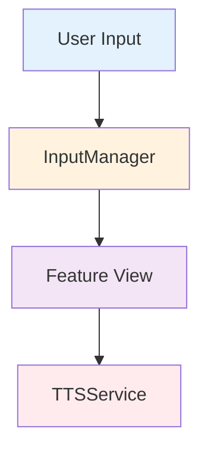
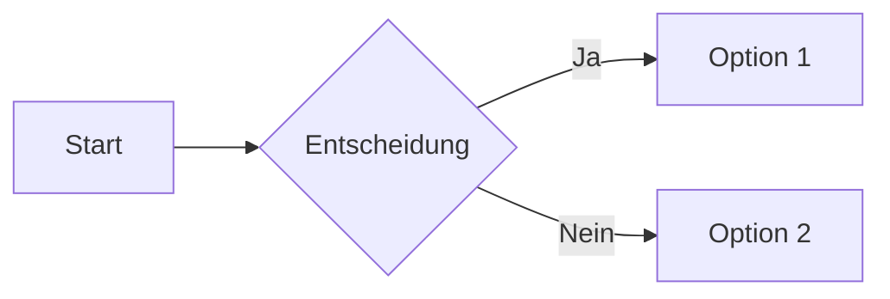
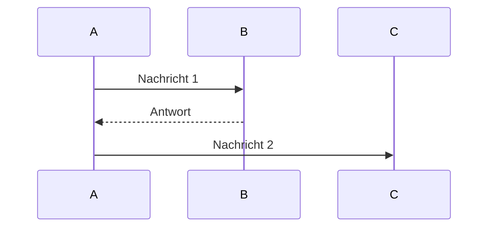
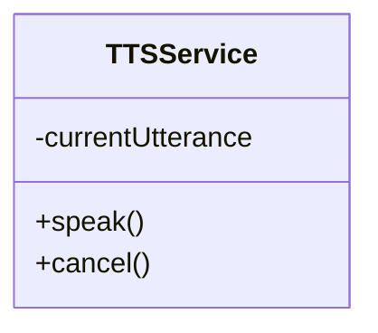
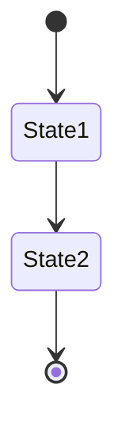
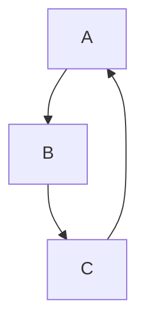
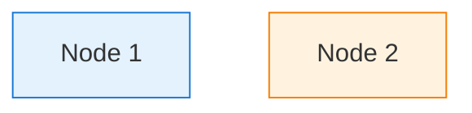
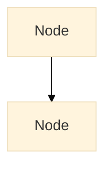

# 🎨 Architektur-Visualisierung - Schnellstart-Anleitung

## ⚡ Schnellste Methode (30 Sekunden!)

### VS Code Extension installieren

1. **Öffne VS Code**
2. **Cmd+Shift+X** (Extensions öffnen)
3. **Suche:** `Markdown Preview Mermaid Support`
4. **Installiere:** Extension von "bierner"
5. **Öffne:** `ARCHITEKTURPLAN.md`
6. **Cmd+Shift+V** (Markdown Preview)
7. **Fertig!** 🎉 Alle Diagramme werden automatisch gerendert

---

## 🌐 Online-Visualisierung (Keine Installation!)

### Mermaid Live Editor

1. **Gehe zu:** https://mermaid.live
2. **Kopiere** ein Mermaid-Diagramm aus `ARCHITEKTURPLAN.md`
3. **Füge ein** in den Editor
4. **Exportiere** als PNG/SVG/PDF

**Beispiel-Diagramm zum Testen:**



---

## 📦 VS Code Extensions (Empfohlen)

### Option 1: Markdown Preview Mermaid Support
- **Name:** `bierner.markdown-mermaid`
- **Vorteil:** Einfach, direkt in VS Code
- **Installation:** `code --install-extension bierner.markdown-mermaid`

### Option 2: Markdown Preview Enhanced
- **Name:** `shd101wyy.markdown-preview-enhanced`
- **Vorteil:** Mehr Features, Export-Möglichkeiten
- **Installation:** `code --install-extension shd101wyy.markdown-preview-enhanced`

### Option 3: Mermaid Editor
- **Name:** `tomoyukim.vscode-mermaid-editor`
- **Vorteil:** Dedizierter Mermaid-Editor
- **Installation:** `code --install-extension tomoyukim.vscode-mermaid-editor`

---

## 🖼️ Export als Bild

### Methode 1: Mermaid CLI

```bash
# Installiere Mermaid CLI
npm install -g @mermaid-js/mermaid-cli

# Exportiere einzelnes Diagramm
mmdc -i diagram.mmd -o diagram.png

# Exportiere alle Diagramme aus Markdown
mmdc -i ARCHITEKTURPLAN.md -o architektur.png
```

### Methode 2: Online Export

1. Gehe zu https://mermaid.live
2. Füge Diagramm ein
3. Klicke auf "Actions" → "Download PNG/SVG"

### Methode 3: VS Code Extension

Mit "Markdown Preview Enhanced":
1. Rechtsklick auf Preview
2. "Export" → "PNG" oder "PDF"

---

## 📊 Verfügbare Diagramm-Typen

### 1. Flowcharts (Flussdiagramme)


### 2. Sequence Diagrams (Sequenzdiagramme)


### 3. Class Diagrams (Klassendiagramme)


### 4. State Diagrams (Zustandsdiagramme)


### 5. Graph Diagrams (Graphen)


---

## 🎯 Schnellzugriff auf Diagramme

### In ARCHITEKTURPLAN.md findest du:

1. **Architektur-Übersicht** (Flowchart)
   - Zeigt alle Layer und ihre Beziehungen

2. **Datenfluss-Diagramm** (Flowchart)
   - User Input → InputManager → Features → Services

3. **TTS-Flow** (Sequence Diagram)
   - SimpleFlowController → TTSService → SpeechSynthesis API

4. **AutoMode-Flow** (Sequence Diagram)
   - useAutoMode → TTSService → TimerManager

5. **Cleanup-Flow** (Flowchart)
   - Router Guard → ViewCleanupRegistry → CleanupCoordinator

6. **Feature-Kollaborationsbaum** (Graph)
   - Zeigt Abhängigkeiten zwischen Features und Services

7. **Service-Hierarchie** (Graph)
   - Zentrale Services und ihre Beziehungen

8. **Abhängigkeits-Regeln** (Graph)
   - Clean Architecture Dependency Rules

---

## 🔧 Troubleshooting

### Problem: Diagramme werden nicht angezeigt

**Lösung 1:** VS Code Extension installieren
- Siehe oben: "VS Code Extension installieren"

**Lösung 2:** Online-Editor nutzen
- Gehe zu https://mermaid.live
- Kopiere Diagramm-Code

**Lösung 3:** GitHub/GitLab nutzen
- Lade Datei auf GitHub/GitLab hoch
- Öffne `.md` Datei im Browser
- Diagramme werden automatisch gerendert

### Problem: Export funktioniert nicht

**Lösung:** Mermaid CLI installieren
```bash
npm install -g @mermaid-js/mermaid-cli
mmdc -i input.md -o output.png
```

---

## 📝 Tipps & Tricks

### 1. Interaktive Diagramme in VS Code
- Mit "Markdown Preview Enhanced" kannst du Diagramme interaktiv bearbeiten
- Rechtsklick → "Mermaid Editor" öffnen

### 2. Diagramm-Farben anpassen


### 3. Diagramm-Größe anpassen


### 4. Mehrere Diagramme in einer Datei
- Jedes Diagramm in eigenen ` ```mermaid ` Block
- Werden alle automatisch gerendert

---

## 🚀 Quick Commands

```bash
# VS Code Extension installieren
code --install-extension bierner.markdown-mermaid

# Mermaid CLI installieren
npm install -g @mermaid-js/mermaid-cli

# Diagramm exportieren
mmdc -i diagram.mmd -o diagram.png

# Alle Diagramme aus Markdown exportieren
mmdc -i ARCHITEKTURPLAN.md -o architektur.png
```

---

## 📚 Weitere Ressourcen

- **Mermaid Dokumentation:** https://mermaid.js.org/
- **Mermaid Live Editor:** https://mermaid.live
- **VS Code Extension:** https://marketplace.visualstudio.com/items?itemName=bierner.markdown-mermaid
- **Mermaid CLI:** https://github.com/mermaid-js/mermaid-cli

---

**Empfohlene Methode:** VS Code Extension + Markdown Preview  
**Schnellste Methode:** Online Mermaid Live Editor  
**Für Export:** Mermaid CLI

