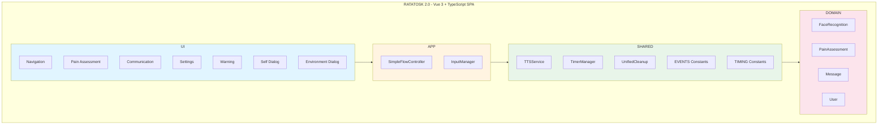
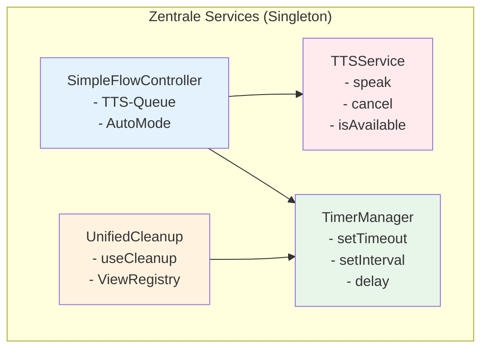
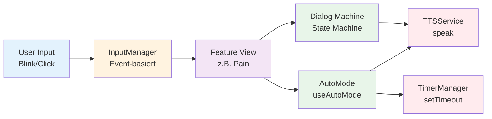
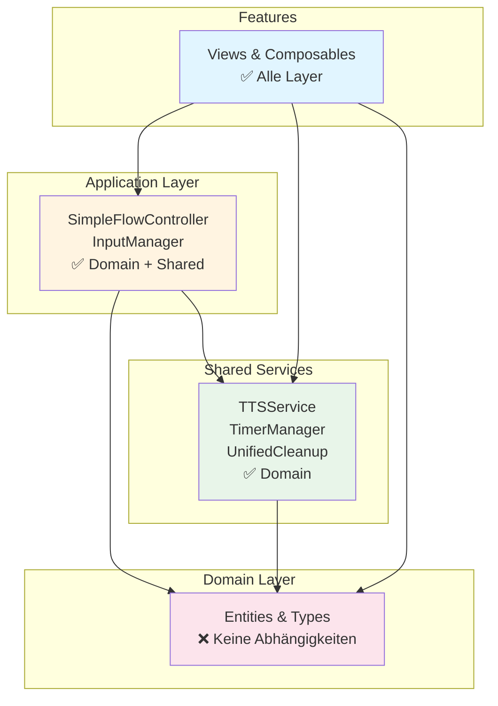
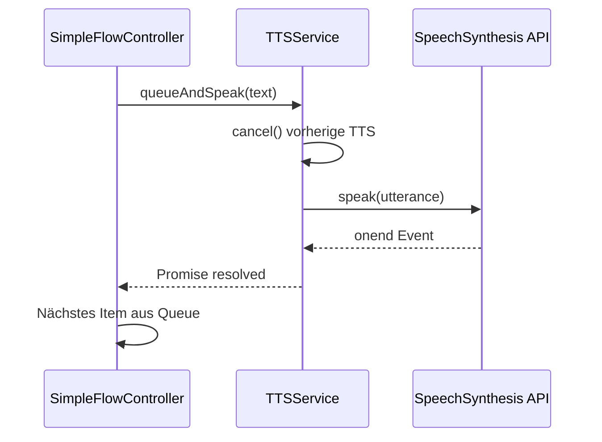
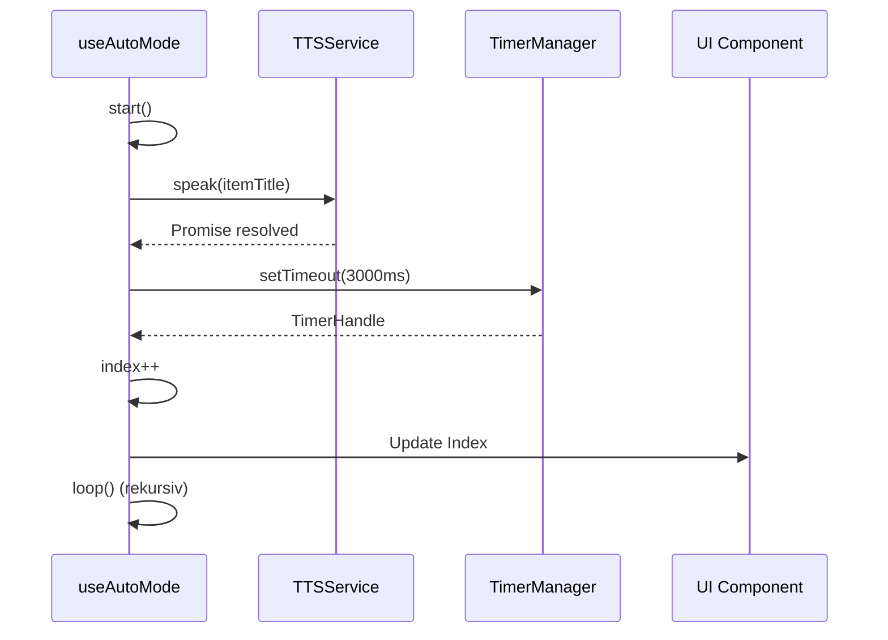
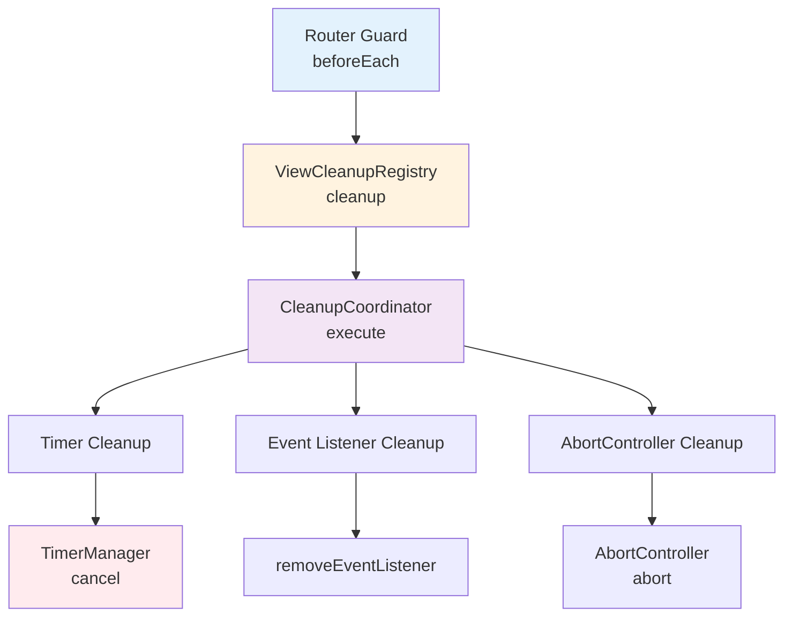
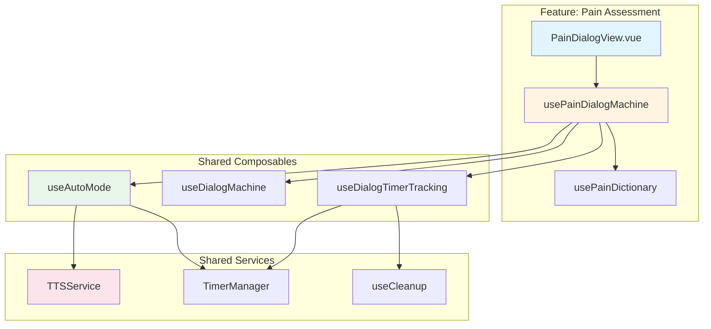

# 🏗️ Ratatosk 2.0 - Detaillierter Architekturplan

## 📋 Inhaltsverzeichnis
1. [Architektur-Übersicht](#architektur-übersicht)
2. [Clean Architecture Ebenen](#clean-architecture-ebenen)
3. [Zentrale Service-Architektur](#zentrale-service-architektur)
4. [Feature-Struktur](#feature-struktur)
5. [Datenfluss und Abhängigkeiten](#datenfluss-und-abhängigkeiten)
6. [Komponenten-Interaktionen](#komponenten-interaktionen)
7. [Technologie-Stack](#technologie-stack)

---

## 🎯 Architektur-Übersicht

### Mermaid-Diagramm (interaktiv visualisierbar)



### ASCII-Diagramm (Fallback)

```
┌─────────────────────────────────────────────────────────────────┐
│                        RATATOSK 2.0                              │
│                    Vue 3 + TypeScript SPA                        │
└─────────────────────────────────────────────────────────────────┘
                              │
                              ▼
        ┌─────────────────────────────────────────┐
        │         UI Layer (Features)             │
        │  ┌───────────────────────────────────┐ │
        │  │  Feature-basierte Views            │ │
        │  │  - Navigation                      │ │
        │  │  - Pain Assessment                 │ │
        │  │  - Communication                   │ │
        │  │  - Settings                        │ │
        │  │  - Warning                         │ │
        │  └───────────────────────────────────┘ │
        └─────────────────────────────────────────┘
                              │
                              ▼
        ┌─────────────────────────────────────────┐
        │      Application Layer (Services)       │
        │  ┌───────────────────────────────────┐ │
        │  │  SimpleFlowController              │ │
        │  │  InputManager                      │ │
        │  └───────────────────────────────────┘ │
        └─────────────────────────────────────────┘
                              │
                              ▼
        ┌─────────────────────────────────────────┐
        │    Shared Services & Utilities          │
        │  ┌───────────────────────────────────┐ │
        │  │  TTSService                        │ │
        │  │  TimerManager                      │ │
        │  │  UnifiedCleanup                    │ │
        │  │  EVENTS (Constants)                │ │
        │  │  TIMING (Constants)                │ │
        │  └───────────────────────────────────┘ │
        └─────────────────────────────────────────┘
                              │
                              ▼
        ┌─────────────────────────────────────────┐
        │         Domain Layer (Entities)         │
        │  ┌───────────────────────────────────┐ │
        │  │  FaceRecognition                  │ │
        │  │  PainAssessment                   │ │
        │  │  Message                           │ │
        │  │  User                              │ │
        │  └───────────────────────────────────┘ │
        └─────────────────────────────────────────┘
```

---

## 🏛️ Clean Architecture Ebenen

### 1. Domain Layer (`src/core/domain/`)
**Zweck:** Business-Logik und Entities (keine Abhängigkeiten)

```
core/domain/
├── entities/
│   ├── FaceRecognition.ts      # Gesichtserkennungs-Entity
│   ├── PainAssessment.ts       # Schmerz-Assessment-Entity
│   ├── PainRecord.ts            # Schmerz-Record-Entity
│   ├── Message.ts               # Nachrichten-Entity
│   └── User.ts                  # Benutzer-Entity
└── types/
    ├── BodyPart.ts              # Körperteil-Typen
    └── Branded.ts               # Branded Types
```

**Prinzipien:**
- ✅ Keine Abhängigkeiten zu anderen Layern
- ✅ Reine TypeScript-Interfaces und Types
- ✅ Business-Logik ohne Framework-Abhängigkeiten

---

### 2. Application Layer (`src/core/application/`)
**Zweck:** Use Cases und zentrale Services

```
core/application/
├── SimpleFlowController.ts      # Zentrale Flow-Steuerung
│   ├── TTS-Queue-Verwaltung
│   ├── AutoMode-Koordination
│   ├── View-Management
│   └── Mute-State-Management
└── InputManager.ts              # Zentrale Input-Abstraktion
    ├── Blink-Erkennung
    ├── Click-Erkennung
    ├── Touch-Erkennung
    └── Cooldown-Mechanismus
```

**SimpleFlowController:**
- **Singleton-Pattern** für globale Zustandsverwaltung
- **TTS-Queue** für sequenzielle Sprachausgabe
- **AutoMode-Koordination** für HomeView-Navigation
- **View-Management** für aktive View-Tracking
- **Mute-State** mit localStorage-Persistenz

**InputManager:**
- **Event-basierte** Blink-Erkennung
- **Polling-Fallback** für Edge-Cases
- **Einheitliche Input-Schnittstelle** für alle Eingabemethoden
- **Cooldown-Mechanismus** verhindert Doppel-Auslösungen

---

### 3. Shared Services & Utilities (`src/shared/`)
**Zweck:** Wiederverwendbare Services und Utilities

```
shared/
├── services/
│   └── TTSService.ts            # Zentrale TTS-Logik
│       ├── Promise-basierte API
│       ├── AbortController-Support
│       ├── Fehlerbehandlung
│       └── Voice-Management
│
├── utils/
│   ├── TimerManager.ts          # Vereinheitlichtes Timer-Management
│   │   ├── setTimeout() → TimerHandle
│   │   ├── setInterval() → TimerHandle
│   │   ├── requestAnimationFrame() → TimerHandle
│   │   └── delay() → Promise<void>
│   │
│   ├── UnifiedCleanup.ts       # Vereinheitlichtes Cleanup-System
│   │   ├── CleanupCoordinator  # Component-scoped Cleanup
│   │   ├── ViewCleanupRegistry # View-scoped Cleanup
│   │   └── useCleanup()        # Vue Composable
│   │
│   ├── CleanupCoordinator.ts   # Basis-Cleanup-Implementierung
│   ├── errorHandling.ts        # Zentrale Fehlerbehandlung
│   └── debug.ts                # Debug-Utilities
│
├── constants/
│   ├── events.ts                # Event-Konstanten (EVENTS)
│   │   └── Eliminiert Magic Strings
│   └── timing.ts                # Timing-Konstanten (TIMING)
│       └── Eliminiert Magic Numbers
│
├── composables/
│   ├── useAutoMode.ts           # Wiederverwendbares AutoMode
│   ├── useDialogMachine.ts      # Dialog State Machine
│   ├── useDialogTimerTracking.ts # Dialog Timer Tracking
│   ├── useInputManager.ts      # Input-Manager Composable
│   ├── useSingleEyeBlinkHandler.ts # Einzelne Augen-Blinzeln
│   └── useTTSWithCancellation.ts # TTS mit Cancellation (deprecated)
│
└── components/
    └── AppHeader.vue            # Globale Header-Komponente
```

---

## 🎨 Feature-Struktur

### Feature-Template
Jedes Feature folgt einer konsistenten Struktur:

```
features/[feature-name]/
├── views/
│   ├── [Feature]View.vue        # Haupt-View-Komponente
│   └── [Feature]View.css        # Feature-spezifische Styles
├── composables/
│   ├── use[Feature]Machine.ts   # State Machine (für Dialoge)
│   ├── use[Feature]Dictionary.ts # Dictionary-System
│   └── [feature-spezifische Composables]
├── data/
│   └── [feature-data].ts        # Statische Daten
├── stores/                       # Optional: Pinia Stores
│   └── [feature]Store.ts
└── services/                     # Optional: Feature-Services
    └── [Feature]Service.ts
```

---

### Feature-Übersicht

#### 1. Navigation (`features/navigation/`)
```
navigation/
├── views/
│   ├── StartView.vue            # Startseite
│   ├── HomeView.vue              # Hauptmenü
│   └── HomeView.ts               # HomeView-Logik
├── composables/
│   ├── useHomeViewLogic.ts       # HomeView-Logik
│   └── [weitere Composables]
└── config/
    └── menuConfig.ts             # Menü-Konfiguration
```

**Zuständigkeiten:**
- Startseite und Hauptmenü
- Navigation zwischen Features
- AutoMode für Menü-Navigation

---

#### 2. Pain Assessment (`features/pain-assessment/`)
```
pain-assessment/
├── views/
│   └── PainDialogView.vue        # Schmerz-Dialog
├── composables/
│   ├── usePainDialogMachine.ts   # Pain Dialog State Machine
│   └── usePainDictionary.ts     # Pain Dictionary & Grammar
└── data/
    ├── painRegions.ts            # Schmerz-Regionen
    ├── painLevels.ts             # Schmerz-Level
    └── painGrammar.ts            # Grammatik-Regeln
```

**State Machine:**
```
mainView → subRegionView → painScaleView → confirmation → mainView
```

**Zuständigkeiten:**
- Hierarchische Schmerz-Erfassung
- Pain Scale Visualisierung
- Dynamische Bestätigungstexte

---

#### 3. Self Dialog (`features/self-dialog/`)
```
self-dialog/
├── views/
│   └── SelfDialogView.vue        # Ich-Dialog
├── composables/
│   ├── useIchDialogMachine.ts   # Ich Dialog State Machine
│   └── useIchDictionary.ts      # Ich Dictionary
└── data/
    └── ichCategories.ts          # Ich-Kategorien
```

**Kategorien:**
- Ernährung
- Gefühle
- Kleidung
- Hygiene
- Bewegung

---

#### 4. Environment Dialog (`features/environment-dialog/`)
```
environment-dialog/
├── views/
│   └── EnvironmentDialogView.vue # Umgebung-Dialog
├── composables/
│   ├── useUmgebungDialogMachine.ts # Umgebung Dialog State Machine
│   └── useUmgebungDictionary.ts  # Umgebung Dictionary
└── data/
    ├── umgebungCategories.ts    # Umgebungs-Kategorien
    └── umgebungVerbs.ts          # Verben
```

**Zuständigkeiten:**
- Umgebungs-Ausdrücke
- Verb-Integration
- Hierarchische Navigation

---

#### 5. Communication (`features/communication/`)
```
communication/
├── views/
│   └── CommunicationView.vue    # Virtuelles Keyboard
├── composables/
│   ├── useVirtualKeyboard.ts    # Keyboard-Logik
│   ├── useBlinkInput.ts         # Blink-Input für Keyboard
│   └── useSpeech.ts             # Speech-Synthese
├── data/
│   └── keyboardLayout.ts        # Keyboard-Layouts
├── stores/
│   ├── communication.ts         # Communication Store
│   └── keyboardDesign.ts        # Keyboard-Design Store
└── services/
    └── KeyboardDesignService.ts  # Keyboard-Design Service
```

**Zuständigkeiten:**
- Virtuelles Keyboard
- Scanning-Modus
- Text-Speicherung
- TTS-Integration

---

#### 6. Settings (`features/settings/`)
```
settings/
├── views/
│   └── SettingsDialogView.vue    # Einstellungen-Dialog
├── composables/
│   ├── useSettingsDialogMachine.ts # Settings State Machine
│   └── useSettingsDictionary.ts  # Settings Dictionary
├── data/
│   ├── settingsCategories.ts    # Einstellungs-Kategorien
│   └── settingsOptions.ts       # Einstellungs-Optionen
├── stores/
│   └── settings.ts               # Settings Store (Pinia)
└── constants/
    └── settingsDefaults.ts       # Standard-Werte
```

**Zuständigkeiten:**
- Konsolidiertes Dialog-System
- Live-Anzeige aktueller Werte
- Persistenz in localStorage

---

#### 7. Warning (`features/warning/`)
```
warning/
├── views/
│   ├── WarningView.vue          # Warngeräusch-View
│   ├── WarningView.ts            # Warning-Logik
│   └── WarningView.css           # Warning-Styles
```

**State Machine:**
```
greeting → bell_idle → bell_playing → back_active → greeting
```

**Zuständigkeiten:**
- Warngeräusch-Funktionalität
- AudioContext-Management
- Auto-Reset-Mechanismus

---

#### 8. Face Recognition (`features/face-recognition/`)
```
face-recognition/
├── composables/
│   └── useFaceRecognition.ts    # Face Recognition Composable
└── services/
    └── FaceRecognitionService.ts # Face Recognition Service
```

**Zuständigkeiten:**
- MediaPipe Face Mesh Integration
- Blinzel-Erkennung
- Einzelne Augen-Blinzeln
- Event-basierte Kommunikation

---

## 🔄 Zentrale Service-Architektur

### Service-Hierarchie (Mermaid)



### ASCII-Diagramm (Fallback)

```
┌─────────────────────────────────────────────────────────┐
│              Zentrale Services (Singleton)               │
├─────────────────────────────────────────────────────────┤
│                                                          │
│  ┌──────────────────┐    ┌──────────────────┐         │
│  │   TTSService     │    │  TimerManager     │         │
│  │                  │    │                   │         │
│  │  - speak()       │    │  - setTimeout()   │         │
│  │  - cancel()       │    │  - setInterval()   │         │
│  │  - isAvailable() │    │  - delay()         │         │
│  └──────────────────┘    └──────────────────┘         │
│                                                          │
│  ┌──────────────────┐    ┌──────────────────┐         │
│  │ UnifiedCleanup   │    │ SimpleFlowCtrl   │         │
│  │                  │    │                  │         │
│  │  - useCleanup()   │    │  - TTS-Queue     │         │
│  │  - ViewRegistry   │    │  - AutoMode      │         │
│  └──────────────────┘    └──────────────────┘         │
│                                                          │
└─────────────────────────────────────────────────────────┘
```

---

### TTSService
**Zweck:** Zentrale TTS-Logik (eliminiert Code-Duplikation)

**API:**
```typescript
class TTSService {
  // Promise-basierte TTS-Ausgabe
  async speak(
    text: string,
    config?: Partial<TTSConfig>,
    options?: TTSOptions
  ): Promise<void>
  
  // Stoppt aktuelle TTS-Ausgabe
  cancel(): void
  
  // Prüft Verfügbarkeit
  isAvailable(): boolean
  
  // Prüft ob gerade gesprochen wird
  getIsSpeaking(): boolean
}
```

**Verwendung:**
- ✅ SimpleFlowController (für Queue)
- ✅ useTTSWithCancellation (deprecated, nutzt intern TTSService)
- ✅ WarningView (direkt)
- ✅ Alle Dialoge (über useDialogMachine)

---

### TimerManager
**Zweck:** Vereinheitlichtes Timer-Management (verhindert Memory Leaks)

**API:**
```typescript
class TimerManager {
  // Erstellt Timeout (gibt TimerHandle zurück)
  setTimeout(callback: () => void, delay: number): TimerHandle
  
  // Erstellt Interval (gibt TimerHandle zurück)
  setInterval(callback: () => void, delay: number): TimerHandle
  
  // Erstellt AnimationFrame (gibt TimerHandle zurück)
  requestAnimationFrame(callback: () => void): TimerHandle
  
  // Promise-basierter Delay
  delay(ms: number): Promise<void>
  
  // Stoppt alle Timer
  cancelAll(): void
}

interface TimerHandle {
  readonly id: TimerId
  cancel(): void
  readonly cancelled: boolean
}
```

**Vorteile:**
- ✅ Typisierte Handles statt `number`
- ✅ Automatisches Tracking
- ✅ Einfache Cancellation: `handle.cancel()`
- ✅ Memory Leak Prevention

**Verwendung:**
- ✅ SimpleFlowController (alle Timer)
- ✅ useAutoMode (AutoMode-Timer)
- ✅ useDialogTimerTracking (Dialog-Timer)
- ✅ InputManager (Blink-Check-Interval)
- ✅ TTSService (Delays)

---

### UnifiedCleanup
**Zweck:** Vereinheitlichtes Cleanup-System

**Komponenten:**

1. **CleanupCoordinator** (Basis)
   ```typescript
   class CleanupCoordinator {
     register(cleanup: CleanupFunction, name?: string): void
     registerTimer(handle: TimerHandle, name?: string): void
     registerEventListener(target, event, handler, name?): void
     registerAbortController(controller, name?): void
     async execute(): Promise<void>
   }
   ```

2. **ViewCleanupRegistry** (View-scoped)
   ```typescript
   class ViewCleanup {
     register(viewName: string, cleanup: CleanupFunction): void
     async cleanup(viewName: string): Promise<void>
     async cleanupAll(): Promise<void>
     hasCleanup(viewName: string): boolean
   }
   ```

3. **useCleanup** (Vue Composable)
   ```typescript
   function useCleanup(context?: string): CleanupScope
   ```

**Verwendung:**
- ✅ Router Guards (View-Cleanup)
- ✅ Views (onMounted/onUnmounted)
- ✅ Composables (automatisches Cleanup)
- ✅ useDialogTimerTracking (Timer-Cleanup)

---

## 📊 Datenfluss und Abhängigkeiten

### Datenfluss-Diagramm (Mermaid)



### ASCII-Diagramm (Fallback)

```
┌──────────────┐
│   User Input │
│ (Blink/Click)│
└──────┬───────┘
       │
       ▼
┌──────────────────┐
│  InputManager    │
│  (Event-basiert) │
└──────┬───────────┘
       │
       ▼
┌──────────────────┐      ┌──────────────┐
│  Feature View    │◄─────┤  AutoMode    │
│  (z.B. Pain)     │      │  (useAutoMode)│
└──────┬───────────┘      └──────┬───────┘
       │                         │
       │                         │
       ▼                         ▼
┌──────────────────┐      ┌──────────────┐
│ Dialog Machine   │      │  TTSService │
│ (State Machine)  │─────►│  (speak())  │
└──────────────────┘      └──────────────┘
```

---

### Abhängigkeits-Regeln (Mermaid)



### Abhängigkeits-Regeln (Text)

**Domain Layer:**
- ❌ Keine Abhängigkeiten
- ✅ Nur TypeScript-Interfaces und Types

**Application Layer:**
- ✅ Kann Domain Layer nutzen
- ✅ Kann Shared Services nutzen
- ❌ Keine Abhängigkeiten zu Features

**Shared Services:**
- ✅ Kann Domain Layer nutzen
- ❌ Keine Abhängigkeiten zu Features
- ❌ Keine Abhängigkeiten zu Application Layer

**Features:**
- ✅ Können alle anderen Layer nutzen
- ✅ Kommunizieren über Services
- ✅ Nutzen Composables für Logik

---

## 🔗 Komponenten-Interaktionen

### TTS-Flow (Mermaid)



### AutoMode-Flow (Mermaid)



### Cleanup-Flow (Mermaid)



### Feature-Kollaborationsbaum (Mermaid)



### ASCII-Diagramme (Fallback)

**TTS-Flow:**
```
┌─────────────────┐
│ SimpleFlowCtrl  │
│  (TTS-Queue)    │
└────────┬────────┘
         │
         │ queueAndSpeak()
         ▼
┌─────────────────┐
│   TTSService    │
│   speak()       │
└────────┬────────┘
         │
         │ Promise
         ▼
┌─────────────────┐
│ SpeechSynthesis │
│     API         │
└─────────────────┘
```

**AutoMode-Flow:**
```
┌─────────────────┐
│  useAutoMode    │
│  (Composable)   │
└────────┬────────┘
         │
         │ loop()
         ▼
┌─────────────────┐      ┌──────────────┐
│  TTSService     │      │ TimerManager │
│  speak()        │      │ setTimeout() │
└────────┬────────┘      └──────┬───────┘
         │                      │
         │ Promise              │ TimerHandle
         ▼                      ▼
┌─────────────────┐      ┌──────────────┐
│  Next Item      │      │  Cleanup     │
│  (Index++)      │      │  (automatisch)│
└─────────────────┘      └──────────────┘
```

**Cleanup-Flow:**
```
┌─────────────────┐
│  Router Guard   │
│  (beforeEach)   │
└────────┬────────┘
         │
         │ ViewCleanupRegistry.cleanup()
         ▼
┌─────────────────┐
│ ViewCleanup     │
│ Registry        │
└────────┬────────┘
         │
         │ coordinator.execute()
         ▼
┌─────────────────┐
│ CleanupCoord    │
│ (alle Cleanups) │
└────────┬────────┘
         │
         │ handle.cancel()
         ▼
┌─────────────────┐
│ TimerManager    │
│ (Timer-Cleanup) │
└─────────────────┘
```

---

## 📈 Visualisierung der Architektur

### 🚀 Schnelle Visualisierung - Optionen

#### Option 1: VS Code Extension (Empfohlen - am schnellsten!)
1. **Installiere Extension:**
   - Öffne VS Code
   - Gehe zu Extensions (Cmd+Shift+X)
   - Suche: "Markdown Preview Mermaid Support"
   - Installiere: `bierner.markdown-mermaid`

2. **Visualisiere:**
   - Öffne `ARCHITEKTURPLAN.md` in VS Code
   - Drücke `Cmd+Shift+V` (Preview)
   - Alle Mermaid-Diagramme werden automatisch gerendert!

#### Option 2: Online Mermaid Editor (Keine Installation!)
1. **Gehe zu:** https://mermaid.live
2. **Kopiere** ein Mermaid-Diagramm aus diesem Dokument
3. **Füge ein** in den Editor
4. **Exportiere** als PNG/SVG

#### Option 3: GitHub/GitLab (Automatisch!)
- Wenn du das Repo auf GitHub/GitLab hochlädst
- Werden Mermaid-Diagramme automatisch gerendert
- Einfach die `.md` Datei öffnen

#### Option 4: VS Code Markdown Preview Enhanced
1. **Installiere:** `shd101wyy.markdown-preview-enhanced`
2. **Öffne** `ARCHITEKTURPLAN.md`
3. **Rechtsklick** → "Markdown Preview Enhanced: Open Preview to the Side"
4. **Alle Diagramme** werden automatisch gerendert

#### Option 5: Mermaid CLI (für Export)
```bash
# Installiere Mermaid CLI
npm install -g @mermaid-js/mermaid-cli

# Exportiere als PNG
mmdc -i ARCHITEKTURPLAN.md -o architektur.png

# Exportiere als SVG
mmdc -i ARCHITEKTURPLAN.md -o architektur.svg
```

### 📊 Verfügbare Diagramm-Typen

In diesem Dokument findest du:
- ✅ **Flowcharts** - Architektur-Übersicht, Datenfluss
- ✅ **Sequence Diagrams** - TTS-Flow, AutoMode-Flow
- ✅ **Graph Diagrams** - Feature-Kollaborationsbäume
- ✅ **ASCII-Diagramme** - Fallback für alle Diagramme

### 🎨 Diagramm-Farben

- 🔵 **Blau** - UI Layer / User Input
- 🟠 **Orange** - Application Layer / Services
- 🟢 **Grün** - Shared Services / Utilities
- 🔴 **Rot** - Domain Layer / APIs

---

## 🛠️ Technologie-Stack

### Frontend-Framework
- **Vue.js 3.5.18** (Composition API)
- **TypeScript 5.x** (vollständige Typsicherheit)
- **Vite** (Build-Tool)

### State Management
- **Pinia** (Vue Store)
  - Settings Store
  - Communication Store
  - Keyboard Design Store

### Routing
- **Vue Router 4.x** (History Mode)
  - Route-basierte Navigation
  - Navigation Guards mit Cleanup

### UI/UX
- **CSS Custom Properties** (Theme-System)
- **Responsive Design** (Mobile/Tablet/Desktop)
- **Dark Mode** (automatisch)

### Media & Recognition
- **MediaPipe Face Mesh** (Gesichtserkennung)
- **Web Speech API** (Text-to-Speech)
- **Web Audio API** (Warngeräusch)

### Utilities
- **TimerManager** (vereinheitlichtes Timer-Management)
- **TTSService** (zentrale TTS-Logik)
- **UnifiedCleanup** (Cleanup-System)
- **EVENTS** (Event-Konstanten)
- **TIMING** (Timing-Konstanten)

---

## 📐 Architektur-Prinzipien

### 1. Clean Architecture
- ✅ **Separation of Concerns**: Klare Trennung Domain/Application/UI
- ✅ **Dependency Inversion**: Abhängigkeiten zeigen nach innen
- ✅ **Single Responsibility**: Jede Komponente hat einen Zweck

### 2. DRY (Don't Repeat Yourself)
- ✅ **Zentrale Services**: TTSService, TimerManager eliminieren Duplikation
- ✅ **Wiederverwendbare Composables**: useAutoMode, useDialogMachine
- ✅ **Konstanten**: EVENTS, TIMING eliminieren Magic Strings/Numbers

### 3. SOLID-Prinzipien
- ✅ **Single Responsibility**: Jede Klasse/Composable hat einen Zweck
- ✅ **Open/Closed**: Erweiterbar durch neue Features
- ✅ **Dependency Inversion**: Abhängigkeiten über Interfaces

### 4. Feature-Based Organization
- ✅ **Isolation**: Features sind unabhängig
- ✅ **Wiederverwendbarkeit**: Shared-Composables für gemeinsame Logik
- ✅ **Skalierbarkeit**: Neue Features einfach hinzufügbar

---

## 🔐 Sicherheit und Performance

### Memory Management
- ✅ **TimerManager**: Automatisches Tracking und Cleanup
- ✅ **UnifiedCleanup**: Automatische Ressourcen-Bereinigung
- ✅ **onUnmounted**: Lifecycle-basiertes Cleanup

### Performance-Optimierungen
- ✅ **Lazy Loading**: Komponenten werden on-demand geladen
- ✅ **Computed Properties**: Effiziente Reaktivität
- ✅ **Timer-Optimierung**: Zentrales Timer-Management

### Fehlerbehandlung
- ✅ **Zentrale Error-Handling**: errorHandling.ts
- ✅ **Promise-basierte APIs**: Konsistente Fehlerbehandlung
- ✅ **Timeout-Mechanismen**: Verhindert Hänger

---

## 📝 Zusammenfassung

### Architektur-Highlights

1. **Zentrale Services**
   - TTSService: Eliminiert TTS-Duplikation
   - TimerManager: Vereinheitlichtes Timer-Management
   - UnifiedCleanup: Einheitliches Cleanup-System

2. **Feature-basierte Struktur**
   - Jedes Feature ist isoliert
   - Konsistente Struktur über alle Features
   - Einfache Erweiterbarkeit

3. **Clean Architecture**
   - Klare Trennung Domain/Application/UI
   - Dependency Inversion
   - Testbare Architektur

4. **TypeScript-Typsicherheit**
   - Über 250 Interfaces und Types
   - Vollständige Typsicherheit
   - Compile-Zeit-Fehlererkennung

5. **Wiederverwendbarkeit**
   - Composables für gemeinsame Logik
   - Zentrale Services für Duplikations-Vermeidung
   - Konstanten für Magic Strings/Numbers

---

**Version:** 2.0  
**Letzte Aktualisierung:** 2025  
**Architektur-Pattern:** Clean Architecture + Feature-Based Organization

