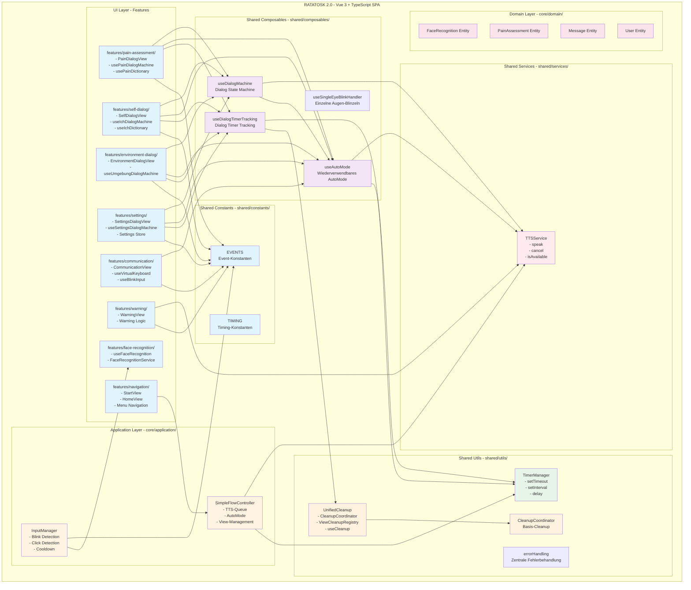
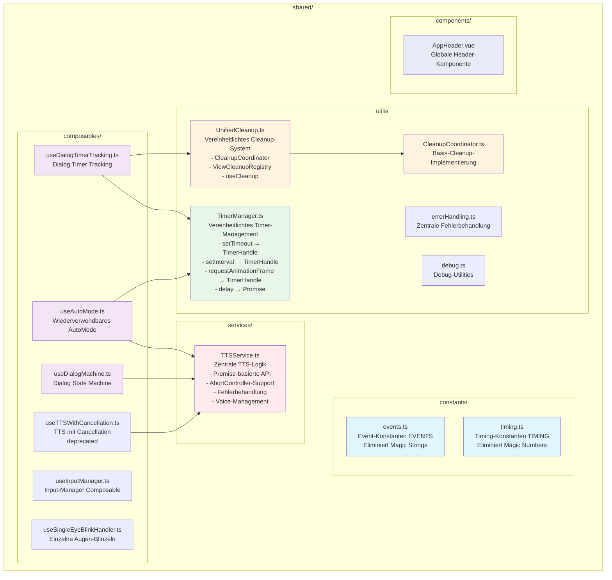
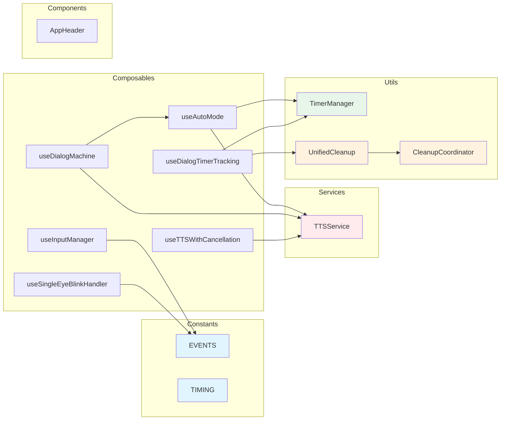
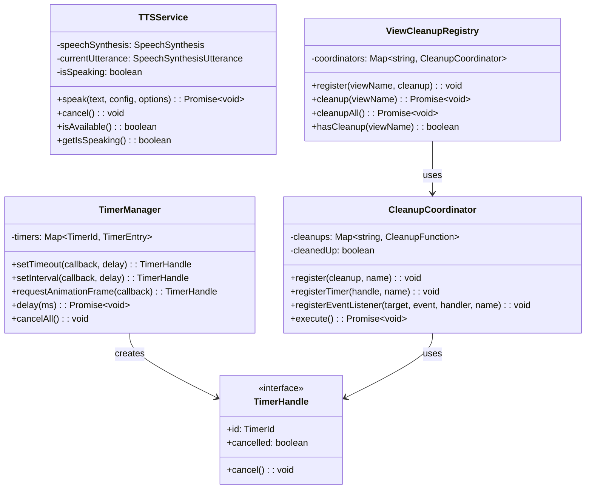
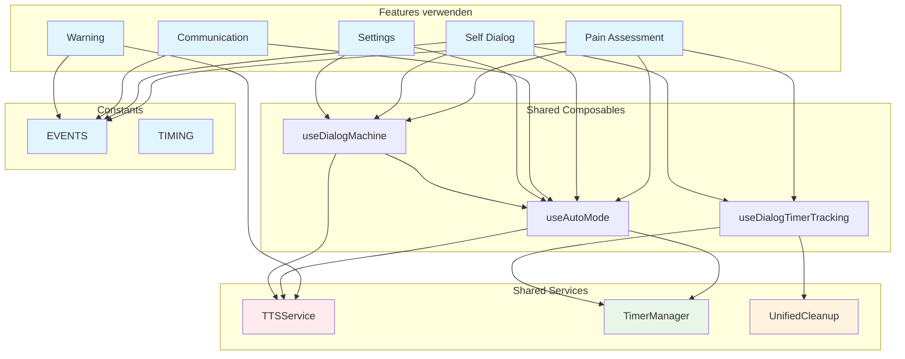

# 📁 Vollständige Architektur als Mermaid-Diagramm

## 🎯 Komplette Projekt-Struktur mit allen Features



---

## 📁 Shared-Verzeichnis Struktur (Detail)



---

## 🎯 Feature-Collaboration-Diagramm (Detailliert)

```mermaid
graph TB
    subgraph "Features - UI Layer"
        NAV[features/navigation/<br/>StartView, HomeView<br/>Menu Navigation]
        PAIN[features/pain-assessment/<br/>PainDialogView<br/>usePainDialogMachine<br/>usePainDictionary]
        SELF[features/self-dialog/<br/>SelfDialogView<br/>useSelfDialogMachine<br/>useSelfDictionary]
        ENV[features/environment-dialog/<br/>EnvironmentDialogView<br/>useEnvironmentDialogMachine<br/>useEnvironmentDictionary]
        COMM[features/communication/<br/>CommunicationView<br/>useVirtualKeyboard<br/>useBlinkInput<br/>useSpeech]
        SETT[features/settings/<br/>SettingsDialogView<br/>useSettingsDialogMachine<br/>Settings Store]
        WARN[features/warning/<br/>WarningView<br/>Warning Logic<br/>AudioContext]
        FACE[features/face-recognition/<br/>useFaceRecognition<br/>FaceRecognitionService<br/>MediaPipe Integration]
    end
    
    subgraph "Application Layer"
        SFC[SimpleFlowController<br/>TTS-Queue Management<br/>AutoMode Control<br/>View State Management]
        IM[InputManager<br/>Blink Detection<br/>Click Detection<br/>Cooldown Management]
    end
    
    subgraph "Shared Services"
        TTS[TTSService<br/>Text-to-Speech]
        TM[TimerManager<br/>Timer Management]
        UC[UnifiedCleanup<br/>Cleanup Coordination]
    end
    
    subgraph "Shared Composables"
        AM[useAutoMode<br/>Auto-Navigation]
        DM[useDialogMachine<br/>Dialog State Machine]
        DT[useDialogTimerTracking<br/>Timer Tracking]
    end
    
    subgraph "Shared Constants"
        EV[EVENTS<br/>Event Names]
        TI[TIMING<br/>Timing Values]
    end
    
    %% Feature zu Application
    NAV --> SFC
    PAIN --> SFC
    SELF --> SFC
    ENV --> SFC
    COMM --> SFC
    SETT --> SFC
    WARN --> SFC
    
    %% Feature zu Face Recognition
    COMM --> FACE
    PAIN --> FACE
    SELF --> FACE
    ENV --> FACE
    SETT --> FACE
    WARN --> FACE
    
    %% Feature zu Shared Composables
    PAIN --> DM
    PAIN --> AM
    PAIN --> DT
    SELF --> DM
    SELF --> AM
    SELF --> DT
    ENV --> DM
    ENV --> AM
    ENV --> DT
    SETT --> DM
    SETT --> AM
    SETT --> DT
    COMM --> AM
    
    %% Feature zu InputManager
    PAIN --> IM
    SELF --> IM
    ENV --> IM
    SETT --> IM
    
    %% Application zu Services
    SFC --> TTS
    SFC --> TM
    IM --> FACE
    IM --> EV
    
    %% Composables zu Services
    AM --> TTS
    AM --> TM
    DM --> TTS
    DM --> AM
    DT --> TM
    DT --> UC
    
    %% Feature zu Constants
    PAIN --> EV
    SELF --> EV
    ENV --> EV
    COMM --> EV
    SETT --> EV
    WARN --> EV
    FACE --> EV
    
    %% Styling
    style NAV fill:#e1f5ff
    style PAIN fill:#e1f5ff
    style SELF fill:#e1f5ff
    style ENV fill:#e1f5ff
    style COMM fill:#e1f5ff
    style SETT fill:#e1f5ff
    style WARN fill:#e1f5ff
    style FACE fill:#e1f5ff
    style SFC fill:#fff4e1
    style IM fill:#fff4e1
    style TTS fill:#ffebee
    style TM fill:#e8f5e9
    style UC fill:#fff3e0
    style AM fill:#f3e5f5
    style DM fill:#f3e5f5
    style DT fill:#f3e5f5
    style EV fill:#e1f5ff
    style TI fill:#e1f5ff
```



---

## 🔗 Abhängigkeits-Diagramm (Vereinfacht)



---

## 📊 Klassendiagramm (Services)



---

## 🔄 Verwendungs-Diagramm



---

---

## 📦 Feature-Interne Struktur (Detailliert)

```mermaid
graph TB
    subgraph "Feature: Pain Assessment"
        PAIN_V[PainDialogView.vue<br/>UI Component]
        PAIN_M[usePainDialogMachine<br/>State Machine Logic]
        PAIN_D[usePainDictionary<br/>Dictionary & Grammar]
        PAIN_DATA[data/<br/>painAssessmentData.ts<br/>painAssessmentGrammar.ts<br/>painLevels.ts<br/>regions.ts]
        
        PAIN_V --> PAIN_M
        PAIN_M --> PAIN_D
        PAIN_D --> PAIN_DATA
    end
    
    subgraph "Feature: Self Dialog"
        SELF_V[SelfDialogView.vue<br/>UI Component]
        SELF_M[useSelfDialogMachine<br/>State Machine Logic]
        SELF_D[useSelfDictionary<br/>Dictionary]
        SELF_DATA[data/<br/>selfDialogData.ts]
        
        SELF_V --> SELF_M
        SELF_M --> SELF_D
        SELF_D --> SELF_DATA
    end
    
    subgraph "Feature: Communication"
        COMM_V[CommunicationView.vue<br/>UI Component]
        COMM_K[useVirtualKeyboard<br/>Keyboard Logic]
        COMM_B[useBlinkInput<br/>Blink Input Handler]
        COMM_S[useSpeech<br/>Speech Synthesis]
        COMM_STORE[stores/<br/>communication.ts<br/>keyboardDesign.ts]
        COMM_DATA[data/<br/>keyboardLayout.ts]
        
        COMM_V --> COMM_K
        COMM_V --> COMM_B
        COMM_V --> COMM_S
        COMM_K --> COMM_STORE
        COMM_K --> COMM_DATA
    end
            
            subgraph "Feature: Settings"
                SETT_V[SettingsDialogView.vue<br/>UI Component]
                SETT_M[useSettingsDialogMachine<br/>State Machine]
                SETT_D[useSettingsDictionary<br/>Dictionary]
                SETT_STORE[stores/<br/>settings.ts<br/>Pinia Store]
                SETT_DATA[data/<br/>categories.ts<br/>options.ts<br/>settingsGrammar.ts]
                
                SETT_V --> SETT_M
                SETT_M --> SETT_D
                SETT_M --> SETT_STORE
                SETT_D --> SETT_DATA
            end
            
            subgraph "Feature: Warning"
                WARN_V[WarningView.vue<br/>UI Component]
                WARN_T[WarningView.ts<br/>Warning Logic]
                WARN_C[WarningView.css<br/>Styles]
                
                WARN_V --> WARN_T
            end
            
            subgraph "Feature: Face Recognition"
                FACE_C[useFaceRecognition<br/>Composable]
                FACE_S[FaceRecognitionService<br/>Service Layer]
                FACE_MP[MediaPipe Integration<br/>Face Mesh Detection]
                
                FACE_C --> FACE_S
                FACE_S --> FACE_MP
            end
            
            style PAIN_V fill:#e1f5ff
            style SELF_V fill:#e1f5ff
            style COMM_V fill:#e1f5ff
            style SETT_V fill:#e1f5ff
            style WARN_V fill:#e1f5ff
            style FACE_C fill:#e1f5ff
        ```

        ---

        ## 📋 Vollständige Projekt-Struktur (Text-Version zum Kopieren)

        ```
        RATATOSK 2.0 - Vue 3 + TypeScript SPA
        │
        ├── src/
        │   │
        │   ├── features/                          # Feature-basierte Architektur
        │   │   │
        │   │   ├── navigation/                    # Navigation & Start
        │   │   │   ├── views/
        │   │   │   │   ├── StartView.vue          # Startseite
        │   │   │   │   ├── HomeView.vue           # Hauptmenü
        │   │   │   │   ├── HomeView.ts            # HomeView-Logik
        │   │   │   │   ├── HomeView.css           # Styles
        │   │   │   │   └── StartView.css          # Styles
        │   │   │   ├── composables/
        │   │   │   │   ├── useAutoScroll.ts       # Auto-Scroll
        │   │   │   │   ├── useCarousel.ts         # Carousel-Logik
        │   │   │   │   ├── useCarouselPosition.ts # Position-Tracking
        │   │   │   │   └── useTouchCarousel.ts    # Touch-Gesten
        │   │   │   └── config/
        │   │   │       └── carouselConfig.ts      # Carousel-Konfiguration
        │   │   │
        │   │   ├── pain-assessment/              # Schmerz-Erfassung
        │   │   │   ├── views/
        │   │   │   │   └── PainDialogView.vue     # Schmerz-Dialog UI
        │   │   │   ├── composables/
        │   │   │   │   ├── usePainDialogMachine.ts  # State Machine
        │   │   │   │   └── usePainDictionary.ts     # Dictionary & Grammar
        │   │   │   └── data/
        │   │   │       ├── painAssessmentData.ts    # Schmerz-Daten
        │   │   │       ├── painAssessmentGrammar.ts # Grammatik-Regeln
        │   │   │       ├── painLevels.ts            # Schmerz-Level
        │   │   │       └── regions.ts               # Körper-Regionen
        │   │   │
        │   │   ├── self-dialog/                    # Ich-Dialog
        │   │   │   ├── views/
        │   │   │   │   └── SelfDialogView.vue      # Ich-Dialog UI
        │   │   │   ├── composables/
        │   │   │   │   ├── useSelfDialogMachine.ts # State Machine
        │   │   │   │   └── useSelfDictionary.ts    # Dictionary
        │   │   │   └── data/
        │   │   │       └── selfDialogData.ts        # Ich-Daten
        │   │   │
        │   │   ├── environment-dialog/             # Umgebung-Dialog
        │   │   │   ├── views/
        │   │   │   │   └── EnvironmentDialogView.vue # Umgebung-Dialog UI
        │   │   │   ├── composables/
        │   │   │   │   ├── useEnvironmentDialogMachine.ts # State Machine
        │   │   │   │   └── useEnvironmentDictionary.ts    # Dictionary
        │   │   │   └── data/
        │   │   │       ├── environmentDialogData.ts # Umgebungs-Daten
        │   │   │       ├── environmentGrammar.ts   # Grammatik
        │   │   │       ├── items.ts                # Items
        │   │   │       ├── regions.ts             # Regionen
        │   │   │       └── verbs.ts               # Verben
        │   │   │
        │   │   ├── communication/                  # Kommunikation
        │   │   │   ├── views/
        │   │   │   │   ├── CommunicationView.vue  # Virtuelles Keyboard UI
        │   │   │   │   └── CommunicationView.css  # Styles
        │   │   │   ├── composables/
        │   │   │   │   ├── useVirtualKeyboard.ts  # Keyboard-Logik
        │   │   │   │   ├── useBlinkInput.ts       # Blink-Input Handler
        │   │   │   │   ├── useSpeech.ts           # Speech-Synthese
        │   │   │   │   └── useTimers.ts           # Timer-Management
        │   │   │   ├── data/
        │   │   │   │   └── keyboardLayout.ts      # Keyboard-Layouts
        │   │   │   ├── stores/
        │   │   │   │   ├── communication.ts      # Communication Store (Pinia)
        │   │   │   │   └── keyboardDesign.ts     # Keyboard-Design Store (Pinia)
        │   │   │   └── services/
        │   │   │       └── KeyboardDesignService.ts # Keyboard-Design Service
        │   │   │
        │   │   ├── settings/                       # Einstellungen
        │   │   │   ├── views/
        │   │   │   │   └── SettingsDialogView.vue  # Einstellungen-Dialog UI
        │   │   │   ├── composables/
        │   │   │   │   ├── useSettingsDialogMachine.ts # State Machine
        │   │   │   │   └── useSettingsDictionary.ts    # Dictionary
        │   │   │   ├── data/
        │   │   │   │   ├── categories.ts           # Einstellungs-Kategorien
        │   │   │   │   ├── options.ts             # Einstellungs-Optionen
        │   │   │   │   └── settingsGrammar.ts     # Grammatik
        │   │   │   ├── stores/
        │   │   │   │   └── settings.ts            # Settings Store (Pinia)
        │   │   │   ├── services/
        │   │   │   │   └── settingsStorage.ts     # Storage Service
        │   │   │   └── constants/
        │   │   │       └── defaults.ts            # Standard-Werte
        │   │   │
        │   │   ├── warning/                        # Warngeräusch
        │   │   │   └── views/
        │   │   │       ├── WarningView.vue          # Warning UI
        │   │   │       ├── WarningView.ts          # Warning-Logik
        │   │   │       └── WarningView.css         # Styles
        │   │   │
        │   │   └── face-recognition/               # Gesichtserkennung
        │   │       ├── composables/
        │   │       │   └── useFaceRecognition.ts   # Face Recognition Composable
        │   │       └── services/
        │   │           └── FaceRecognitionService.ts # Face Recognition Service
        │   │
        │   ├── core/                               # Core Application Layer
        │   │   │
        │   │   ├── application/                    # Application Services
        │   │   │   ├── SimpleFlowController.ts     # TTS-Queue, AutoMode, View-Management
        │   │   │   └── InputManager.ts             # Blink Detection, Click Detection, Cooldown
        │   │   │
        │   │   └── domain/                         # Domain Layer
        │   │       ├── entities/                  # Domain Entities
        │   │       │   ├── FaceRecognition.ts      # Face Recognition Entity
        │   │       │   ├── PainAssessment.ts      # Pain Assessment Entity
        │   │       │   ├── PainRecord.ts           # Pain Record Entity
        │   │       │   ├── Message.ts             # Message Entity
        │   │       │   └── User.ts                # User Entity
        │   │       └── types/                     # Domain Types
        │   │           ├── BodyPart.ts            # Body Part Types
        │   │           └── Branded.ts             # Branded Types
        │   │
        │   ├── shared/                             # Shared Utilities & Services
        │   │   │
        │   │   ├── services/                       # Zentrale Services
        │   │   │   └── TTSService.ts               # Text-to-Speech Service
        │   │   │       ├── Promise-basierte API
        │   │   │       ├── AbortController-Support
        │   │   │       ├── Fehlerbehandlung
        │   │   │       └── Voice-Management
        │   │   │
        │   │   ├── utils/                          # Utility-Funktionen
        │   │   │   ├── TimerManager.ts             # Vereinheitlichtes Timer-Management
        │   │   │   │   ├── setTimeout() → TimerHandle
        │   │   │   │   ├── setInterval() → TimerHandle
        │   │   │   │   ├── requestAnimationFrame() → TimerHandle
        │   │   │   │   └── delay() → Promise<void>
        │   │   │   │
        │   │   │   ├── UnifiedCleanup.ts           # Vereinheitlichtes Cleanup-System
        │   │   │   │   ├── CleanupCoordinator      # Component-scoped Cleanup
        │   │   │   │   ├── ViewCleanupRegistry      # View-scoped Cleanup
        │   │   │   │   └── useCleanup()            # Vue Composable
        │   │   │   │
        │   │   │   ├── CleanupCoordinator.ts       # Basis-Cleanup-Implementierung
        │   │   │   ├── errorHandling.ts            # Zentrale Fehlerbehandlung
        │   │   │   └── debug.ts                    # Debug-Utilities
        │   │   │
        │   │   ├── constants/                      # Konstanten
        │   │   │   ├── events.ts                   # Event-Konstanten (EVENTS)
        │   │   │   │   └── Eliminiert Magic Strings
        │   │   │   └── timing.ts                   # Timing-Konstanten (TIMING)
        │   │   │       └── Eliminiert Magic Numbers
        │   │   │
        │   │   ├── composables/                    # Wiederverwendbare Composables
        │   │   │   ├── useAutoMode.ts              # Wiederverwendbares AutoMode
        │   │   │   ├── useDialogMachine.ts         # Dialog State Machine
        │   │   │   ├── useDialogTimerTracking.ts   # Dialog Timer Tracking
        │   │   │   ├── useInputManager.ts          # Input-Manager Composable
        │   │   │   ├── useSingleEyeBlinkHandler.ts # Einzelne Augen-Blinzeln
        │   │   │   └── useTTSWithCancellation.ts   # TTS mit Cancellation (deprecated)
        │   │   │
        │   │   └── components/                      # Shared Components
        │   │       └── AppHeader.vue               # Globale Header-Komponente
        │   │
        │   ├── router/                             # Vue Router
        │   │   └── index.ts                        # Router-Konfiguration
        │   │
        │   ├── stores/                             # Pinia Stores (global)
        │   │   └── [weitere globale Stores]
        │   │
        │   ├── App.vue                             # Root Component
        │   └── main.ts                             # Application Entry Point
        │
        ├── public/                                 # Statische Assets
        │   └── [Assets]
        │
        ├── .github/                                # GitHub Actions
        │   └── workflows/
        │       └── deploy.yml                      # Deployment Workflow
        │
        ├── ARCHITEKTURPLAN.md                      # Detaillierter Architekturplan
        ├── ARCHITEKTUR-VISUALISIERUNG.md           # Mermaid-Diagramme
        ├── IMPLEMENTIERUNG.md                      # Implementierungs-Dokumentation
        ├── SHARED-STRUKTUR-MERMAID.md              # Diese Datei
        │
        └── [Konfigurationsdateien]
            ├── package.json
            ├── tsconfig.json
            ├── vite.config.ts
            └── [weitere Configs]
```

---

## 🎯 Architektur-Schichten (Übersicht)

```
┌─────────────────────────────────────────────────────────────┐
│                    UI Layer (Features)                       │
│  Navigation │ Pain │ Self │ Env │ Comm │ Settings │ Warning  │
└─────────────────────────────────────────────────────────────┘
                            ↓
┌─────────────────────────────────────────────────────────────┐
│              Application Layer (Core)                        │
│         SimpleFlowController │ InputManager                  │
└─────────────────────────────────────────────────────────────┘
                            ↓
┌─────────────────────────────────────────────────────────────┐
│              Shared Services & Utilities                     │
│  TTSService │ TimerManager │ UnifiedCleanup │ Constants     │
└─────────────────────────────────────────────────────────────┘
                            ↓
┌─────────────────────────────────────────────────────────────┐
│                    Domain Layer                              │
│      Entities: FaceRecognition, PainAssessment, etc.          │
└─────────────────────────────────────────────────────────────┘
```

---

## 🔗 Abhängigkeits-Fluss

```
Features
  ↓
Application Layer (SimpleFlowController, InputManager)
  ↓
Shared Services (TTSService, TimerManager, UnifiedCleanup)
  ↓
Shared Constants (EVENTS, TIMING)
  ↓
Domain Entities
```

---

## 📊 Feature → Shared Mapping

```
Pain Assessment      → useDialogMachine, useAutoMode, useDialogTimerTracking
Self Dialog         → useDialogMachine, useAutoMode, useDialogTimerTracking
Environment Dialog  → useDialogMachine, useAutoMode, useDialogTimerTracking
Settings            → useDialogMachine, useAutoMode, useDialogTimerTracking
Communication       → useAutoMode, useVirtualKeyboard
Warning             → TTSService
Navigation          → SimpleFlowController
Face Recognition    → Alle Features (via Events)
```

---

## 🚀 Visualisierung

**Schnellste Methode:**
1. Öffne diese Datei in VS Code
2. Installiere Extension: `bierner.markdown-mermaid`
3. Drücke `Cmd+Shift+V` (Preview)
4. Alle Diagramme werden automatisch gerendert!

**Online:**
- Gehe zu https://mermaid.live
- Kopiere ein Mermaid-Diagramm
- Füge es ein und exportiere als PNG/SVG

